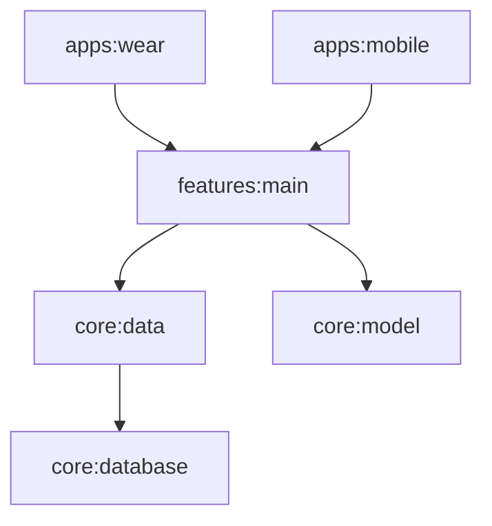

# AshBike: Advanced Cycling Computer (Wear OS, Mobile & XR)

AshBike is a multi-platform cycling telemetry application designed for Android Phone, Wear OS, and XR Glasses. It tracks speed, distance, heart rate, and GPS location in real-time.

## 🏗 Architecture Overview

The project follows **Modern Android Development (MAD)** principles, utilizing a **Single Source of Truth** architecture. 

The core business logic, sensor fusion, and GPS tracking are decoupled from the UI, allowing the **Phone** and **Watch** apps to run independent instances of the same logic engine.

### Module Dependency Graph



* **`features:main`**: Contains the "Brains" of the operation (`BikeForegroundService`, `BikeServiceManager`, repositories).
* **`apps:wear`**: A "Thin Client" UI built with Wear Compose that binds to the shared logic.
* **`apps:mobile`**: The Phone UI implementation.

---

## ⌚ Wear OS Implementation (Standalone)

The Wear OS app is designed to be **Standalone**. It does not require the phone to be connected to track a ride. It uses the Watch's internal GPS and sensors.

### Key Components

1. **`WearBikeScreen` (Compose UI)**
* Pure UI layer. Observes `StateFlow` from the ViewModel.
* Displays Speed, Distance, Heart Rate, and Time.


2. **`WearBikeViewModel` (Hilt)**
* Injects `BikeServiceManager`.
* Exposes a clean `BikeRideInfo` state to the UI.
* Handles UI commands (Start/Stop ride).


3. **`BikeServiceManager` (Shared Logic)**
* Orchestrates the connection to the background service.
* Handles Binding/Unbinding lifecycle automatically.


4. **`BikeForegroundService` (The Engine)**
* Runs as a **Foreground Service** with `location|health` types.
* Collects GPS via `FusedLocationProvider`.
* Calculates physics (Speed, Distance, Calories).
* **Crucial:** Promotes itself to the foreground immediately on creation to satisfy Android 14/15 strict background restrictions.


---

## 🚀 Getting Started

### Prerequisites

* Android Studio Ladybug or newer.
* JDK 17 or 21.
* Wear OS 4/5 Emulator (API 33+).

### Running the Wear App

1. Select the **`applications.ashbike.apps.wear`** configuration in Android Studio.
2. Deploy to a Wear OS Emulator or Physical Device.
3. **Permissions:** On first launch, grant **Location** (While using) and **Body Sensor** permissions.

### 🐛 Debugging GPS on Emulator

Wear OS emulators **do not** simulate movement by default. If you see `0.0 km/h`:

1. Open Emulator Extended Controls (three dots `...`).
2. Select **Location**.
3. Load a GPX/KML file (Found in `applications/ashbike/docs/actions/emulator_route.gpx`).
4. **Press Play** ▶️. The speed will only update when the emulator location moves.

---

## 🛠 Tech Stack

* **Language:** Kotlin
* **UI:** Jetpack Compose (Mobile & Wear)
* **DI:** Hilt (Dagger)
* **Async:** Coroutines & Flow
* **Architecture:** MVVM (Model-View-ViewModel)
* **Services:** Android Foreground Services (Location/Health)
* **Sensors:** FusedLocationProviderClient, Health Services API

---

## ⚠️ Important Implementation Details

### Android 14+ (API 34/35) Compliance

Wear OS 5 imposes strict restrictions on background services.

* **Manifest:** The service must declare `android:foregroundServiceType="location|health"`.
* **Runtime:** The service must call `startForeground()` within milliseconds of creation. Do not wait for a GPS fix to start the foreground notification, or the OS will crash the app with a `ForegroundServiceStartNotAllowedException`.

### Service Logic

The logic resides in `features/main/.../BikeForegroundService.kt`.

* **Phone:** Starts an instance using Phone hardware.
* **Watch:** Starts a *separate* instance using Watch hardware.

---

## 📂 File Structure Highlights

```text
applications/ashbike/
├── apps/
│   ├── wear/               # Wear OS Specific Code
│   │   ├── src/main/AndroidManifest.xml  <-- Declares Services & Permissions
│   │   ├── presentation/   # UI Layer (Compose)
│   │   ├── service/        # Wear-specific Service Wrapper
│   │   └── tile/           # Wear OS Tiles
│   └── mobile/             # Phone App
├── features/
│   └── main/               # SHARED LOGIC (Service, Manager, UseCases)
└── docs/                   # GPX files for simulation

```

## 🤝 Contribution

1. **UI Changes:** Modify `WearBikeScreen.kt`. Use `@Preview` to verify layouts on round screens.
2. **Logic Changes:** Modify `BikeForegroundService.kt` in the `features:main` module. **Note:** This affects both Phone and Watch apps.