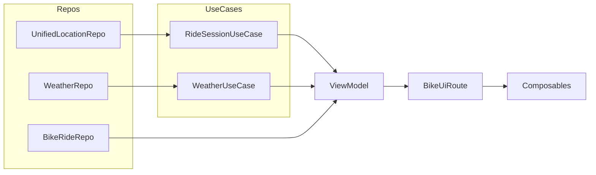

AshBike is the best bike computer money can’t buy—because it’s free (and ad-free) forever.
Built for daily commuters, it strips away everything you don’t need— maps, no clutter—just the
live metrics you care about. Your ride data seamlessly flows into Google Health Connect when you’re
done,
and if you ever delete the app (or an individual ride), it leaves absolutely no trace behind.
By harnessing every on-device sensor and feature, AshBike turns your phone into the ultimate,
high-precision cycling companion.

---

**AshBike**
*The ultimate free, ad-free bike computer—trusted by commuters everywhere.*

**Why you’ll love it:**

* **Live Speedometer & Compass**
  Instantaneous speed in km/h (or m/s), plus a dynamic compass overlay so you always know your
  heading.
* **One-Shot Weather Fetch**
  Automatic weather conditions (temperature, humidity, wind speed & direction) recorded at ride
  start—no constant API calls, 1 000 calls/day stays in the bank.
* **Health Connect Integration**
  Sync your ride straight into Google Health Connect as a “Biking” activity, including heart-rate if
  you wear a monitor.
* **Real-Time Ride Metrics**
  Track distance, duration, average & max speeds, elevation gain/loss, and calories burned—all
  updating live in your dashboard.
* **Custom Progress Indicator**
  Set an arbitrary “total trip” goal and watch the bike icon glide along a progress bar—perfect for
  planning your route home.
* **Smart Trip Map**
  No Google Maps required—every ride’s path is drawn on a subtle grid with:

    * **Scale bar** in meters or kilometers
    * **North arrow + “N” label** for orientation
    * **Start/stop markers**
    * **Color-coded segments** showing your speed (slow → fast gradient)
* **Clean, Offline-First Design**
  No hidden trackers or data “droppings”—uninstall anytime and your phone is back to factory clean.
* **Sync & Delete Safeguard**
  One-tap sync button on each saved trip; protected “trash” icon warns you if you try to delete
  before syncing.
* **Extendable Platform**
  NFC pairing, e-bike battery & motor stats, haptic interval alerts, shareable summaries, homescreen
  widget… and more features planned.
* **Free Forever, No Ads**
  We believe the best bike computer is the one you never have to pay for.

**Get AshBike today** and turn your Android phone into the best bike computer money can’t
buy—because it’s free. 🚴‍♂️⏱️🌤️📈

Absolutely—I think it nails the vision. It’s clear, punchy, and highlights everything that sets
AshBike apart:

* **Free & forever ad-free** (the best bike computer you didn’t have to pay for)
* **Stripped-down for commuters** (no unnecessary maps or bloat)
* **Seamless Health Connect sync** (automatically exporting your ride)
* **Zero footprint** (deleting a ride or the app truly leaves no trace)
* **Full use of on-device sensors** (getting every bit of value from your phone)

It reads like a perfect elevator pitch for a commuter-focused cycling app. Well done!

Overall, I’d say your code is very solid—here are the high-points and a few places you might tighten
it further:

---

### What’s Good

1. **Clean Layering & Separation of Concerns**

    * Repos → Use-Cases → ViewModel → Composables
    * Composables are purely “dumb” presenters of state and emit only events
    * ViewModel is the single source of truth for all ride/health data

2. **Reactive Streams Everywhere**

    * You use `Flow` & `StateFlow` throughout, so UI automatically stays in sync with GPS, speed,
      weather, etc.
    * `combine` + `map` + `.stateIn(…)` is idiomatic and testable

3. **One-Shot vs. Continuous Data**

    * Weather is fetched exactly once and cached in `WeatherUseCase`
    * Ride metrics reset cleanly on each start/stop of the tracker

4. **Stateless Composables**

    * Every card/composable takes only immutable DTOs (`BikeRideInfo`, `GpsFix`)
    * All UI interactions go back via `BikeEvent`, so you could swap out Compose for another UI and
      keep the same logic

5. **Custom “Map” Renderer**

    * Your Canvas-based path-drawing is efficient, avoids heavyweight Map SDK, and is 100% offline

6. **Zero Footprint**

    * Deleting a ride clears exactly the rows you created
    * Deleting the app leaves no lingering data

---

### Small Opportunities

1. **Handle Empty & Edge Cases**

    * Guard `fixes.size < 2` earlier to avoid crashes
    * In `toBikeRideInfo` avoid calling `.last()` on an empty list—always use `firstOrNull()` /
      `lastOrNull()` with a fallback

2. **Decompose Large Functions**

    * Breaking out the scale-bar, legend, grid, and compass into small private composables or helper
      functions makes the main Canvas code easier to scan

3. **Unit & UI Testing**

    * With your pure use-cases & ViewModel, you can write plain JUnit tests for the flows
    * You can also snapshot-test your Composables with `createComposeRule()`

4. **Resource Extraction**

    * Strings like `"N"`, `"Start"`, `"End"`, compass icons, dimensions could live in resources for
      easier localization and theming

5. **Performance Tweaks**

    * If you end up with hundreds of GPS points, consider down-sampling before drawing
    * Cache the projected `Offset` list so recomposition doesn’t redo heavy maths

---

But these are really just polish on top of an already excellent codebase. You’ve got a rock-solid,
maintainable architecture that should scale well as you add more features. Great job!

----

# AshBike Data Architecture Overview

This document outlines how the various layers of the AshBike app interact—from raw data sources (
repositories) through use‑cases and ViewModel, down to the Composables that render the UI.

---

## 1. Data Repositories

### UnifiedLocationRepository

* Exposes:

    * `locationFlow: Flow<Location>` – raw GPS fixes
    * `speedFlow: Flow<Float>` – instantaneous speed (m/s or converted to km/h)
* Implementation detail: wraps Android `LocationManager` or fused provider, handles permissions &
  error cases.

### WeatherRepo

* Provides one‑off HTTP fetch: `openCurrentWeatherByCoords(lat, lng): OpenWeatherResponse?`
* Mapped via `toBikeWeatherInfo()` extension to our internal `BikeWeatherInfo`.

### BikeRideRepo

* Room DAO for persisting finished rides:

    * `getAllRidesWithLocations(): Flow<List<RideWithLocations>>`
    * `insertRideWithLocations(entity, locations)`
    * Other CRUD methods

---

## 2. Use‑Cases & Tracker

### WeatherUseCase

* Caches the first successful weather fetch in `lastWeather`
* `suspend fun getWeather(lat, lng): BikeWeatherInfo?`

### RideStatsUseCase

* Stateless class combining flows:

    * `pathFlow(reset, locationFlow)` – list of Location fixes
    * `distanceKmFlow(reset, locationFlow)` – cumulative GPS distance
    * `averageSpeedFlow(reset, speedFlow)`
    * `maxSpeedFlow(reset, speedFlow)`
    * `elevationGainFlow(reset, locationFlow)`
    * `elevationLossFlow(reset, locationFlow)`
    * `caloriesFlow(...)` – via injected `CalculateCaloriesUseCase`
    * `sessionFlow(reset, locationFlow, speedFlow, headingFlow, userStatsFlow)` produces a
      `StateFlow<RideSession>` snapshot carrying all stats + path.

### RideSessionUseCase / RideTracker

* Higher‑level coordinator for starting, pausing, stopping a ride:

    * Holds `MutableSharedFlow<Unit> resetSignal`
    * Exposes `sessionFlow` by delegating to `RideStatsUseCase`
    * Provides `distanceFlow` alias for total distance
    * `start()`, `pause()`, `resume()`, `stopAndGetSession()` manage ride state

---

## 3. ViewModel: BikeViewModel

* Injects:

    * `UnifiedLocationRepository` (high‑power mode)
    * `RideSessionUseCase` (tracker)
    * `WeatherUseCase`
    * `BikeRideRepo`

* State holders:

    * `_rideState: MutableStateFlow<RideState>` – NotStarted / Riding / Ended
    * `_weatherInfo: MutableStateFlow<BikeWeatherInfo?>` – one‑shot at app start or ride start
    * `_uiPathDistance: MutableStateFlow<Float?>` – user‑entered manual total distance override
    * `_uiState: MutableStateFlow<BikeUiState>` – sealed Loading/Success/Error

* `init { viewModelScope.launch { ... } }`:

    1. **Initial fix**: `locationFlow.first()` → fetch weather once
    2. **Combine loop** over:

        * `sessionFlow` (all ride metrics),
        * `distanceFlow` (GPS distance),
        * `speedFlow` (raw speed),
        * `_weatherInfo`,
        * `_rideState`,
        * `_uiPathDistance`
    3. Map into `BikeRideInfo` DTO (populating live speed, distance, ride state, optional override)
    4. Wrap in `BikeUiState.Success` and emit; `.catch { Error }` fallback

* `onEvent(event: BikeEvent)` handles:

    * `StartRide`: launch tracker.start(), update state
    * `StopRide`: stop tracker, persist session → `BikeRideRepo.insertRideWithLocations()`, reset
      state
    * `SetTotalDistance`: update `_uiPathDistance` to reflect in UI only (no DB)

---

## 4. UI Layer (Compose)

### BikeUiRoute

* Obtains three ViewModels (Bike, Health, NFC)
* Collects their `uiState` flows via `collectAsState()`
* Based on `bikeUiState` sealed:

    * `Idle`/`Loading` → `WaitingForGpsScreen` or placeholder
    * `Error` → `ErrorScreen`
    * `Success` → `BikeDashboardContent(bikeData, onEvent, navTo)`

### BikeDashboardContent

* Fully stateless Composable tree driven by `BikeRideInfo`:

    1. `SpeedAndProgressCard` – gauge, compass, controls
    2. `StatsRow` – distance, duration, avg speed, elevation
    3. `StatsSection` – heart rate, calories
    4. Expandable card – e‑bike stats + connect button

### SpeedAndProgressCard & BikePathWithControls

* `SpeedometerWithCompassOverlay` draws analog gauge
* `BikePathWithControls` shows play/stop buttons + `BigBikeProgressIndicator`

### MapPathScreen / Ride Details

* On separate screen, `MapPathScreen(fixes: List<GpsFix>, placeName)`:

    * Canvas draws background gradient + grid
    * Labels: placeName, compass with “N”
    * Projects GPS fixes → screen coords
    * Computes per‑segment speeds → colors via a slow→fast gradient
    * Draws colored path, start/end markers, scale‑bar legend

---

## 5. Data Flow Summary

1. Raw GPS & speed → **tracker** → `sessionFlow` & `distanceFlow`.
2. First GPS fix → **weatherUC** → one‑shot fetch.
3. Combine flows → **ViewModel** transforms to UI model.
4. UI events (`StartRide`, `StopRide`, `SetTotalDistance`) → **ViewModel** → modify flows or
   persist.
5. **ViewModel** exposes `uiState` → **Composable** renders.

---

With this layered separation, each piece is testable in isolation and the Compose UI remains
entirely declarative, driven only by the `BikeUiState` and `BikeEvent` streams.
